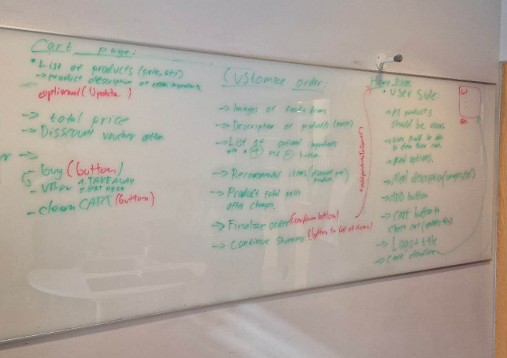
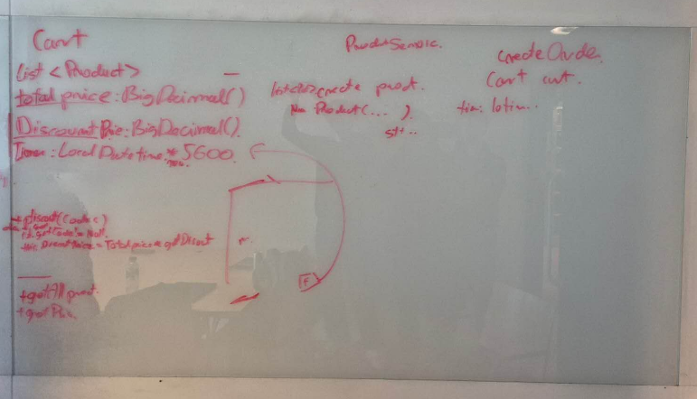
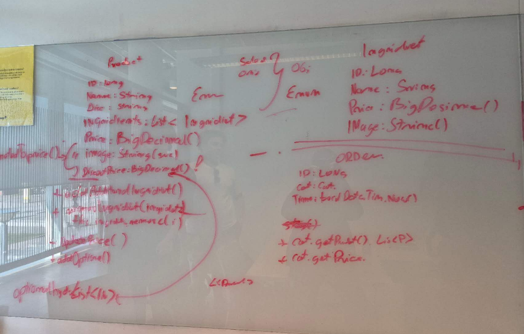
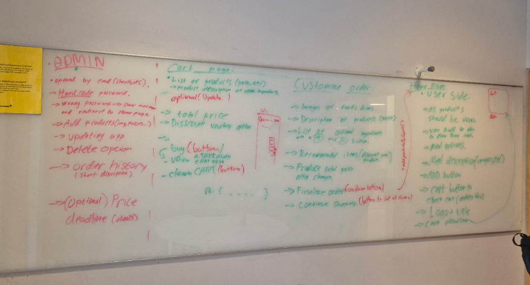
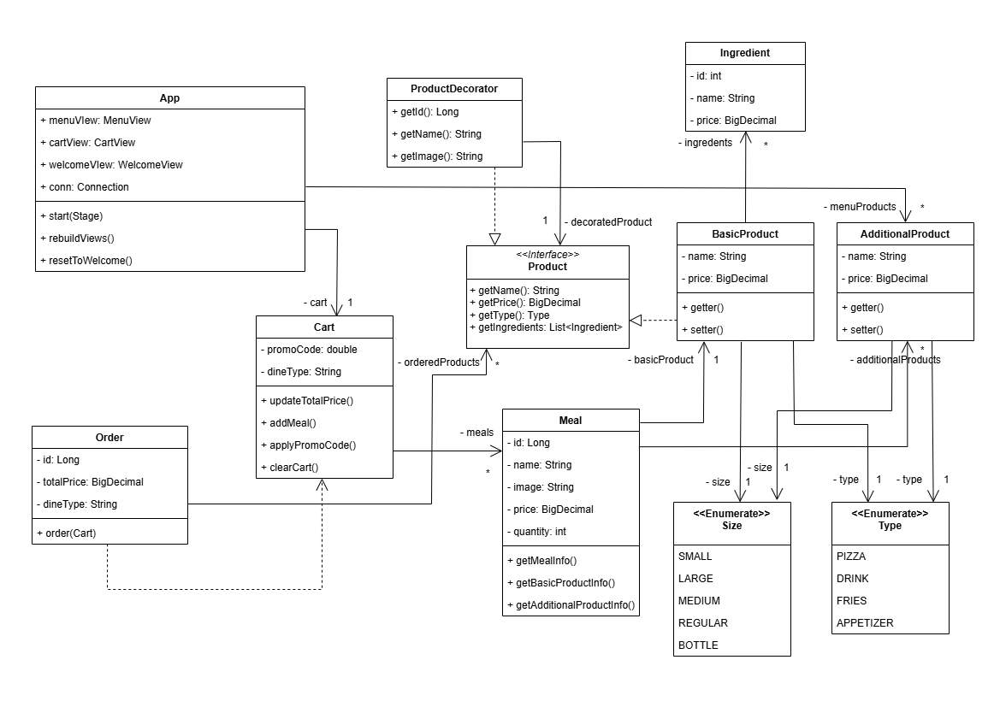
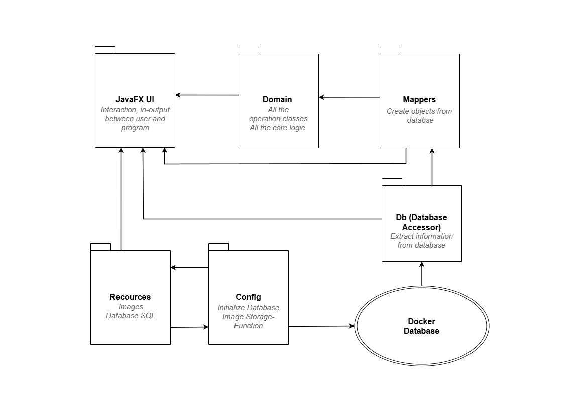

## 🧩 Problem Statement & Goals

### 📌 Problem Statement

Long lines and sluggish service are common in fast-food establishments. The root cause is not employee performance, but outdated systems that limit service efficiency. These systems contribute to delays, dissatisfied customers, and increased operational costs. Customers expect a fast and straightforward ordering experience, while employees require tools that are intuitive and manageable. Unfortunately, many current systems are difficult to update. Routine tasks, such as modifying menu items or applying discounts, often require IT assistance, which causes additional delays and inefficiencies.

### 🎯 Goals

The goal of this project is to develop a **modern and adaptable kiosk system** that enhances the experience for both customers and staff by improving usability, flexibility, and responsiveness.

#### Key features include:

- **Interactive Experience**  
  A streamlined JavaFX interface with views such as `MenuView`, `CartView`, and `WelcomeView` that allow customers to browse the menu and place orders with ease.

- **Real-Time Customization**  
  Through `CustomizeView`, customers can build meals on the spot, with prices updating instantly based on ingredient changes.

- **Flexible Pricing System**  
  The system uses the **Decorator Pattern** to support product variations and dynamic pricing without creating new classes.

- **Secure Admin Panel**  
  Authorized staff can access the admin panel using a keyboard shortcut and PIN to manage inventory, menu updates, and discounts.

- **Modular Code Design**  
  Components like `MealItemView` and `ProductItemView` ensure the system is easy to maintain, manage, and expand.

- **Image & Database Support**  
  Supports both default and custom images, using PostgreSQL and raw SQL for efficient and reliable data handling.

---

---

## 🧠 High-Level System Overview

This project is a **self-service kiosk application** built for restaurants, designed to offer fast, user-friendly customer service while minimizing long queues at traditional cashier stations.

---

## 👥 Customer Experience

### 🧾 Effortless Ordering

Customers can easily place their orders directly through the kiosk, reducing congestion and wait times. The interface allows intuitive interaction and ensures a smooth flow from browsing to checkout.

### 🍔 Menu Navigation

The menu is presented in a clear, category-based layout:

* **Pizza**
* **Appetizer**
* **Drinks**
* **Fries**
* **Meals**

Each category is represented by a **clickable card** at the top of the screen. When selected, it displays a list of related products along with:

* Image
* Description
* Price

### 🛠️ Meal Customization

Customers can personalize their meals in two places:

* From the **Menu View** (before adding to cart)
* From the **Cart View** (after adding to cart)

The **Customize** button allows:

* Adding or removing ingredients
* Selecting from a predefined list of recommended additions

This gives full control to the customer while keeping the experience streamlined.

---

## 🛒 Cart Functionality

### 🧺 Real-Time Cart View

When items are added to the cart:

* They appear in a **Cart Container**
* Quantity and ingredients can be adjusted on the fly
* **Total price updates automatically** based on changes

Each cart item includes:

* A **Customize** button (same as in Menu View)
* A **Remove** button to delete the item from the order

### 🧭 Cart Controls

Beneath the cart, the user has access to four key actions:

1. **Back to Home** – Returns to the Welcome screen
2. **Clear Cart** – Removes all items from the cart
3. **Checkout** – Opens the digital receipt window
4. **Apply Discount** – Lets users enter a promo code

   * Valid codes apply a discount to the total
   * Invalid codes trigger an error message

---

## 🧾 Receipt & Checkout Flow

The **Checkout process** is initiated by clicking the “Checkout” button. This triggers a detailed receipt view that includes:

* Order number
* Dining type (selected at Welcome)
* All ordered products
* Final total
* Buttons: **Confirm** or **Cancel**

### ✅ Confirm Order

* Finalizes the order
* Displays a **Thank you for your order** message
* Redirects the user to the Welcome screen

### ❌ Cancel Order

* Clears the cart
* Returns the user to the menu to start a new order

---

## 🔐 Administrator Panel

### 🎛️ Intuitive Admin Tools

Accessed via `Ctrl + A` and a secure PIN (`0000` by default), the admin panel is designed for **non-technical users** to manage system content with ease.

### 📦 Product & Menu Management

Admins can:

* Add, update, or remove:

  * Individual products
  * Meal combos
  * Additional items (like sides or drinks)
* Assign titles, prices, and images

### 🎟️ Discount Code Management

Admins can:

* Create new discount codes
* Define expiration dates and discount percentages
* Delete codes at any time

### 📊 Order History

The panel also provides:

* A historical list of completed orders
* Date filtering
* Profit tracking and order summaries

---

## 🤝 Unified & User-Friendly System

All components of the application—from customer menu to admin tools—are crafted to work **seamlessly together**. The system prioritizes:

* **Responsiveness**
* **Clarity**
* **Ease of use**

It provides a **smooth experience for customers** placing orders and a **powerful but accessible toolkit for restaurant staff** to manage operations efficiently.

---

## 🧠 System Architecture

The application consists of **three main components**:

- **MENU**
- **CART**
- **ADMINISTRATION PANEL**

Each panel shares core components of the system, such as:

- Classes responsible for database communication
- Shared entities that are persisted in the database and used throughout the application

The core logic of the application centers around **products**. To handle product variations (such as optional ingredients or price adjustments), we implemented the **Decorator Design Pattern**, which allows dynamic modification of product properties without the need to create new subclasses for every variation.

### 📁 Image Storage

Images are managed across two directories:

- `resources/`: Contains default graphics and placeholder images used by the UI.
- A dedicated folder in the **main application directory**: Stores images added by administrators when creating new products. The image is copied from the user’s system into this folder, and the application references it directly during rendering.

---

## 🧰 Technology Stack

- **Language:** Java
- **UI Framework:** JavaFX
- **Database:** PostgreSQL
- **ORM / Utilities:** [Lombok](https://projectlombok.org/) (for reducing boilerplate code)
- **Containerization:** Docker (for managing the PostgreSQL instance)

The application communicates with the database via raw SQL queries. Before running the project, a PostgreSQL container must be created using Docker. Alternatively, you can run the app locally by connecting to an existing PostgreSQL instance configured with the appropriate port, user credentials, and database name.

---

## 🔄 Data Flow & Integration

### 1️⃣ Saving New Objects to the Database (Administrator)

When an administrator submits a form (e.g., to create a product), the data is passed to a class responsible for that entity’s database operations. The `save()` method constructs the relevant SQL query and inserts the new object into the database.

### 2️⃣ Reading Menu Data from the Database

To fetch all objects of a specific food category (e.g., pizzas), a method in the database handler class runs an SQL query and retrieves a `ResultSet`. This result is passed to a **mapper**, which transforms the data into a list of corresponding application-level objects.

If a product includes references to other entities (e.g., a list of ingredients), additional mappers are invoked to fetch and assign these related objects.

---

##  Non-functional Requirements

### 1️⃣ Performance

The performance of our Kiosk application is extraordinary. Our application responds with almost no delay, does not crash in any situation, and includes a well-designed error-handling mechanism. Users can get the information they need immediately, and the system records every order into the database with 100% accuracy.
To ensure continued high performance, we have optimized both the frontend and backend logic. The UI is lightweight and fast to load, and database operations are structured with indexed queries and minimal response time.

### 2️⃣ Reliability & Maintenance

Our application offers great reliability. It shows accurate information to the customer in real time and updates price or ingredient changes immediately after customers modify their orders. For restaurant managers, the application provides valuable functionality, allowing them to review historical order records including order number, checkout time, and ordered items. We use design patterns such as Decorator (we use it to calculate and update price) and modular code structures to ensure that updates and bug fixes can be applied without affecting unrelated modules (we have seven modules about code: config, db, domain, enumeration, mappers, admin, UI). Each module has several related classes to implement their responsibility and follow dependency inversion principle. Moreover, our application is designed to be durable, helping restaurants save time and cost on technical upkeep.

Our architecture supports scalability and future feature expansion. Developers can easily add new functionality by following the Open/Closed Principle, as the codebase is modular, clean, and well-organized. Overall, the system is designed to be durable and cost-effective.

### 3️⃣ Security

We understand that security is important for commercial applications. In admin mode, we use a combination of keyboard shortcuts and password authentication to verify administrator access. Furthermore, we also implement security confirm for features such as discount codes. Only valid discount codes are accepted, and each code can be used only once per order to prevent misuse or financial loss. This ensures that discount mechanisms are both fair and secure.

## Deployment & Operations 🖥️🔧
The application includes a JavaFX user interface and a PostgreSQL database running inside containers to ensure a consistent and stable environment. Updates are generally applied by updating the existing container to a new version, either manually by administrators or via automated deployment pipelines when available.

The system checks to confirm that both the app and database are working correctly and collects basic data on performance and errors. Important user actions, like orders, menu changes, and discount code usage, are logged with timestamps and stored securely. Only authorized staff have access to these logs for review and troubleshooting.

## 2. Project Documentation

## User Stories

As a customer  
I want to see all available products displayed visually (with images and categories)  
So that I can easily browse and decide what to order

As a customer  
I want to clear my entire cart with one action  
So I can restart my order if needed

As a customer  
I want to filter menu items by type of food f.ex ( DRING, PIZZA etc..) And every one type should include an image from a random/first product. So I can quickly find what I want

As a customer  
I want to see descriptions and images for each menu item  
So I know exactly what I’m ordering

As a customer  
I want to adjust quantities or remove items from my cart  
So I can correct mistakes

As a customer  
I want to add items to my cart with one click  
So I can build my order efficiently

As a customer  
I want to see the restaurant’s logo and title on every screen  
So I can trust the kiosk is official

As a customer  
I want to be notified if my cart is about to expire due to inactivity  
So I don’t lose my order

As a customer  
I want to be able to make changes to my order after choosing my desired products  
So that I can see images, food, drinks, and prices while editing

As a customer  
I want to be able to see the product details. So that I can understand what I’m ordering

As a customer  
I would like to see the individual price of each product  
So that I can understand the final cost

As a customer  
I would like to see the total price of the product  
So that I can track my spending

As a customer  
I would like to see a list of all optional changes I can make  
So that I can adjust items to match my taste

As a customer  
It would be nice to have – and + buttons  
So that I can adjust the quantities of extras, food, and drinks

As a customer  
I would like to be recommended items based on my current selection  
So that I can discover relevant additions

As a customer  
I would like to add discounts applied to recommended items  
If a larger quantity of them is added

As a customer  
I want the total cart price to automatically change  
Based on what is added and removed

As a customer  
I want a finalize order button  
So that I can finish my order when satisfied

As a customer  
I want to receive a confirmation message  
After submitting my order for payment

As a customer  
I would like to have a button that takes me back to the menu  
If I want to add more items to my order

As a customer  
I would like to be able to edit my order in this tab  
So that I don’t have to go back and forth

As a customer  
A delete icon would be good. To make the order process easier

As a customer  
I would like an add icon to be able to change the quantity

As a customer  
I would want a clear, minimal layout  
To make the utilization easier

As a customer  
I want to see the item name beside the image  
To easily identify each product

As a customer  
I want to see all the items I selected  
So that I can check my order before paying

As a customer  
I want to see the item ID, name, picture, and quantity  
So that I can be sure of what I ordered

As a customer  
I want to see the total price of my order  
So that I know how much I need to pay

As a customer  
I want to enter a discount code  
So that I can save money if I have a valid code

As a customer  
I want to click a payment button  
So that I can complete my order and get confirmation

As a customer  
I want to clear my cart and go back  
So that I can cancel the order and start again if needed

As a customer  
I want to see a default welcome interface before my purchasing action. (With a artistic desktop and “Start purchasing” button in the center and be able to choose if I want to eat here or take away in the welcome window)

As a customer  
I want to be able to add my discount and checkout ONLY when the cart is not empty.

As a customer  
In the menu interface, I want to see all the choices aligned as rectangle patterns. The Whole pattern is the button. The whole button is covered by the image of the product. Also each menu item’s name, price, and description appear as an overlay on the product image.

As a customer  
I want to be able to have an option button for my products in the cart that allows me to modify the products.

As a customer  
I want to have a clear and simple ui to understand and use in the cart.

As an admin  
I want to open the password input box using a shortcut key (like Ctrl+A)  
So that I can quickly switch to admin mode

As an admin  
I want to enter a password to access admin mode  
So that only authorized users can manage the system

As an admin  
I want to add new items like food, drinks, or meal combos  
So that the menu can have updated options

As an admin  
I want to update item names, prices, or descriptions  
So that I can fix or change menu info

As an admin  
I want to delete old or unwanted items  
So that the menu stays clean

As an admin  
I want to see past orders  
So that I can review what customers bought

As an admin  
I want a clear way to exit admin mode  
So that I can safely return to the main screen

As an admin  
I want to create a new discount code with a start time and end time, so that I can control when the code is active.

## Sketches

## Diagrams

### Class diagram:

### Architecture diagram:

## 3. User Documentation
## How to start the project
#### 1. Set up the database
You may start a database with the following docker command based on the [Bitnami PostgreSQL Image](https://hub.docker.com/r/bitnami/postgresql/):

`docker run --name postgresql -p 5432:5432 -e POSTGRESQL_USERNAME=my_user -e POSTGRESQL_PASSWORD=password123 -e POSTGRESQL_DATABASE=smartkiosk bitnami/postgresql:latest`

#### 2. Start the app 

 ./gradlew build
 ./gradlew run

## 🛠️ Administrator Panel Overview

Access to the administrator panel is granted via the keyboard shortcut `Ctrl + A` followed by entering a PIN code (default: `0000`).

The panel is divided into **three main sections**:

---

### 1️⃣ Menu Content Management

Manage all components that make up the restaurant's menu.

#### 🧂 Ingredients
- Add new ingredients.
- Delete existing ingredients.

#### 🍔 Basic Products
- Create new base products (e.g., burgers, pizzas) and assign ingredients to them.
- Delete existing basic products.

#### 🧃 Additional Products
- Add side items such as drinks, fries, etc.
- Remove additional products.

#### 🍽️ Meal Composition
- Compose meals by combining a main product with optional additional items.
- Remove meals as needed.
- Meals are fully customizable depending on the administrator’s preferences.

---

### 2️⃣ Edit Existing Menu Items

Update existing objects stored in the database:
- Change product images.
- Update prices.
- Modify assigned ingredients and other properties.

---

### 3️⃣ Orders & Promotions

#### 📋 Order History
- View a list of all orders placed.
- Filter orders between selected date ranges.
- See detailed summaries of ordered items and profits within the selected timeframe.

#### 🎟️ Discount Code Management
- Create new discount codes with:
  - Start and end dates.
  - Percentage-based discounts.
- Delete active discount codes at any time.

---

> ⚙️ All database operations (create, read, update, delete) are handled via dedicated service classes and mappers to ensure clean separation of concerns and maintainability.

